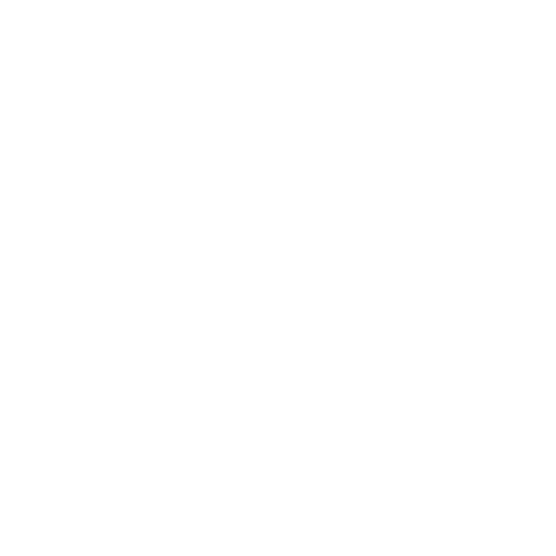

<h1 align="center">Scribe</h1>

<a href="#project-description">Project Description</a> - <a href="#key-features">Key Features</a> - <a href="#technology-stack">Tech Stack</a>

## Project Description

Scribe is a lightweight translation tool built with React + TypeScript + TailwindCSS. It integrates with the MyMemory Translation API to provide instant text translation between multiple languages. The app includes speech synthesis and clipboard utilities, making it useful for quick translations, pronunciation practice, and sharing text.

Live demo: translate-app-steel-rho.vercel.app

## Key Components

App.tsx – main container managing state (source/target language, translations, utilities).

TranslateForm – handles input text and translation requests.

TranslateOutput – displays translated text with controls for speech and copy.

types/types.ts – defines language and data types for strict TypeScript typing.

## Key Features

🔤 Text Translation – powered by MyMemory Translation API.

🔊 Text-to-Speech – listen to original or translated text via browser SpeechSynthesis.

📋 Copy to Clipboard – quickly copy translations.

🌐 Multi-Language Support – English, French, Spanish (easily extendable).

🎨 Responsive UI – clean design built with TailwindCSS.

## Tech Stack

Frontend: Vite React, TailwindCSS, Validators: zod Other: react-hook-form
